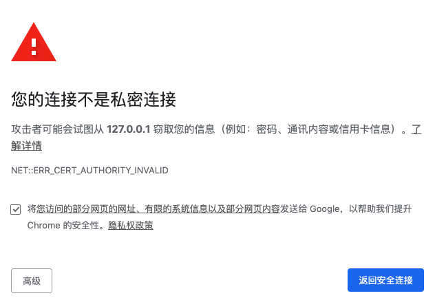

# Https

## webpack 启动个https服务

作为一个前端，webpackDevServer启动个https的服务还是很简单的,只需要修改下webpack里devServer就好。

```js
devServer: {
  https: true, // 启用https
  proxy: {
    '/template': {
      target: 'http://api.test.com.cn',
      changeOrigin: true
    }
  },
  open: true
}
```

然而这样会报网站,使用体验不是很友好，是因为本地没有安装安全证书，不过作为开发使用够用啦

