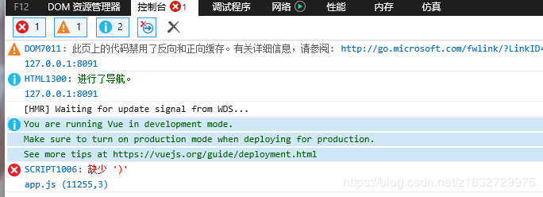
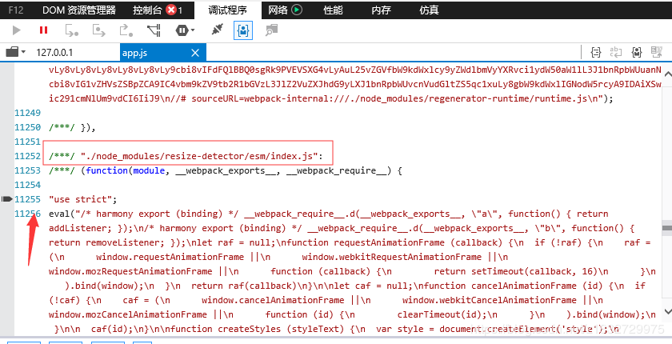
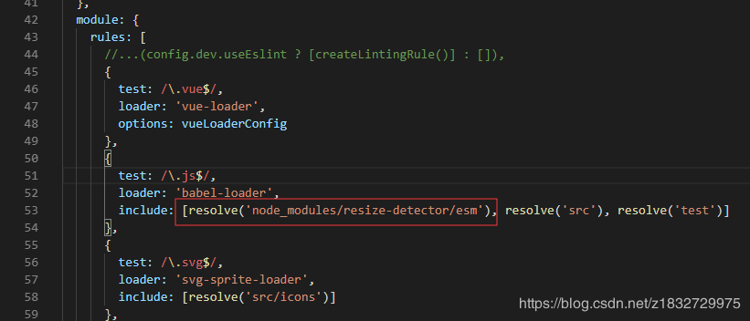

# 对IE浏览器的兼容

工作中总有那个几个应用要兼容ie浏览器，想想就有点头大，各种不兼容呀，如果一开始写的时候就知道还好，如果一开始就怎么舒服怎么来的话，那后面处理ie兼容性，尤其是ie9真的会让你头秃。记录一下那些年与ie的爱恨纠葛吧。

## js

1. .flat() ie11 就会报错，慎用，需要的话还是不要偷懒了，写吧

## 依赖 
1. babel-polyfill    es6的处理
2. es6-promise   promise的处理
3. vuex-persist   版本使用1.8.0一下，不然ie11都打包的错误
4. ie9-oninput-polyfill  ie9 的input输入框清空无效，仍会带着原数据去请求，需要装个依赖去兼容，头秃不。

## 缓存

ie上ajax请求时如果请求参数不变，会默认读取缓存，导致刷新后仍然还是旧的数据，解决方式：每次请求都加上时间戳强制刷新吧

## 表单的恨

1. 上传

刷刷刷的用了element-ui 的upload组件写了上传，心里美滋滋，然而鬼知道ie9不兼容它，ie9的文件上传需使用iframe处理，人家element-ui就给舍了，舍弃这种low的方式我是很赞同的，而然产品就告诉你需要兼容ie9，咋办，不用呗。
自己写个吧，还需要处理刷新页面等问题，还是找个vue-upload-component来处理吧，首先用起来就停费劲呢，它几乎所有的处理都放在了一个事件里，至于发生了啥，自己比较猜去吧，当然它的文档写的还算清除，照了写了，成了。
ie9上赶紧试试吧，结果后台返回的json对象还被ie9给拦截了，气不气，能怎么办，此处只能是🤷‍♀️，明天看看让后台返回json串试试吧。
结果表明是可以的，ie9会拦截json对象，需要后台返回json串，前端自行解析使用

2. input
* placeholder不支持呀
* 可修改value,但清空数据无效，会保留清空前的值

3. select
* placeholder不支持呀
* 不会默认选中第一项option

## 第三方库的es6代码没转换问题

ie打开页面空白，控制台报错缺少

点击app.js跳转到错误位置

其实这样就是这里有部分的ES6代码没有被转换，就会出现报错，把这个报错位置前提示的这个报错路径拷贝下来 node_modules/resize-detector/esm,
在 webpack.base.conf.js 中，下图位置

这样IE没有被转换的ES6代码就被转换啦